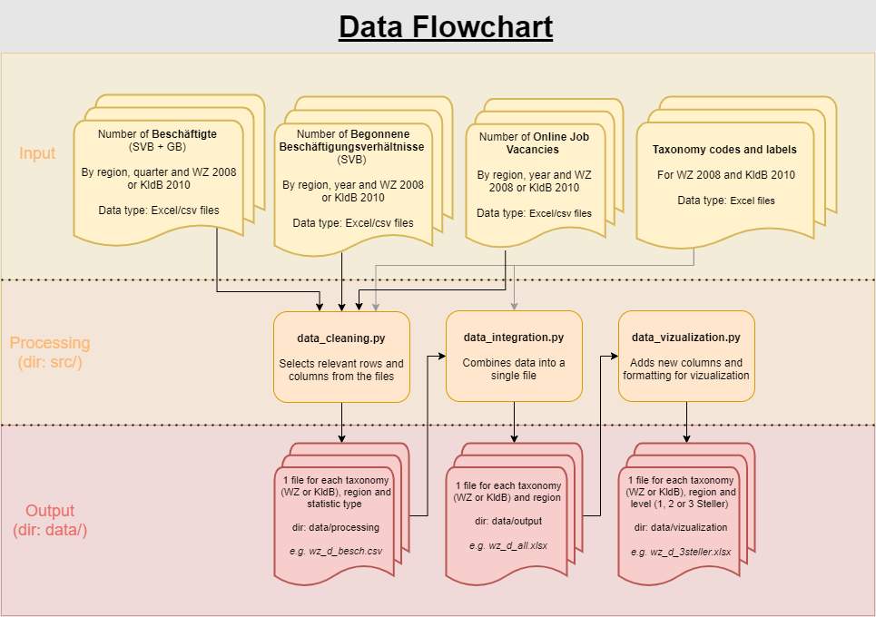

# About this repository

**What it is**: this repository contains scripts written in Python that allow one to compare distributions of online job vacancies to statistical data from the German federal employment agency (Bundesagentur für Arbeit) according to economic sectors (Wirtschaftszweige) and occupations (Berufe) in Germany. In other words, it cleans and integrates different files containing data on employees (Beschäftigte), initiatied employment relationships (begonnene Beschäftigungsverhältnisse) and online job vacancies, unifying all of those into a single file for each classification type (Klassifikation der Wirtschaftszweige 2008 and Klassifikation der Berufe 2010) and region (entire Germany and each federal state).

**Who is it for**: this repo is aimed at anyone working with online job vacancy data and/or employment statistical data who wishes to acquire a better understanding of the distribution of their data according to the German classifications of occupations (KldB 2010) and economic sectors (WZ 2008). 

**Basic requirements**: 
* The online job vacancy data must be already mapped to the Klassifikation der Berufe 2010 or Klassifikation der Wirtschaftszweigen 2008. The code does not provide an automated process of mapping of online job vacancies to these classifications.
* A basic understanding of Python in order to run and adapt the scripts if necessary.

**Why it was created**: this process was created for the project *Kompetenzen für die Arbeit von morgen* of the Bertelsmann Stiftung with the aim of conducting representativeness analyses for the Bertelsmann Stiftung's databank of online job vacancies (DOSTA: Datenbank von Online Stellenanzeigen). Due to the possible reusability of this code by other researchers and/or data experts working with similar data, we therefore decided to publish the code for general use.

**Author(s)**: Gabriel da Silva Zech (gabriel.zech@bertelsmann-stiftung.de).
  

# How to use this repository

1. **Fork the repository**.

2. **Add the files containing the data by the Klassifikation der Wirtschaftszweige (WZ 2008) to ``data/raw/wz`` and by the Klassifikation der Berufe (KldB 2010) to ``data/raw/kldb``.**
    * The files containing data on **Beschäftigte** (i.e. employees) can be downloaded directly from the website of the Bundesagentur für Arbeit
        * Data by WZ 2008: https://statistik.arbeitsagentur.de/SiteGlobals/Forms/Suche/Einzelheftsuche_Formular.html?nn=1523064&topic_f=beschaeftigung-sozbe-wz-heft
        * Data by KldB 2010: https://statistik.arbeitsagentur.de/SiteGlobals/Forms/Suche/Einzelheftsuche_Formular.html?nn=1523064&topic_f=beschaeftigung-sozbe-bo-heft

    * The files containing data on **begonnene Beschäftigungsverhältnisse** (i.e. initiated employment relationships) can be acquired by request against a fee from the statistics office of the Bundesagentur für Arbeit (see https://statistik.arbeitsagentur.de/DE/Navigation/Service/Datenanforderung/Datenanforderung-Nav.html).
        * *Note on file formatting: the files acquired from the Bundesagentur für Arbeit tend to follow a standard formatting. The code under ``src/data_cleaning.py`` is meant to work on this standard formatting without need for adaptations or changes. However, if any issues and unexpected outputs occur or you have an already cleaned version of the file, you can place that cleaned file under ``data/processing``. Just make sure the file name and column names follow the requirements described in ``src/data_cleaning.py``.*
        * *Note on data limitations: as of May 2021, the statistics office of the German Federal Employment Agency (Bundesagentur für Arbeit) only provides data on initiated employment relatonships which are subject to social security (begonnene sozialversicherungspflichtige Beschäftigungsverhältnisse). It is therefore not possible to acquire the same statistics for those who are "marginally" employed (begonnene geringfügige Beschäftigungsverhältnisse). See [this Wikipedia article](https://en.wikipedia.org/wiki/Marginal_employment) to learn more about how marginal employment is defined in Germany.*
    
    * The files containing data on **online job vacancies** must be acquired through other means, e.g. from a data provider or web scraping.

3. **Rename the files placed under ``data/raw/`` so that they adhere to the following naming systems:**
    * *Beschäftigte*: retain the original names of the files downloaded from the website of the BA (e.g. *bo-heft-08-0-201912-xlsx.xlsx* or *wz-heft-d-0-202006-xlsx.xlsx*)
    * *Begonnene Beschäftigungsverhältnisse*: rename the files so they start with ``{stat_type}_{region}_begBesch`` (e.g. *kldb_08_begBesch.xlsx* or *wz_08_begBesch.csv*)
    * *Online job vacancies*: rename the files so they start with ``{stat_type}_{region}_ojv`` (e.g. *kldb_08_ojv.xlsx* or *wz_08_ojv.csv*)
    * For the above:
        * ``{stat_type}`` must be either "wz" or "kldb"
        * ``{region}`` must follow this classification:
                d = entire Germany; 
                01 = Schleswig-Holstein, 
                02 = Hamburg,
                03 = Niedersachsen, 
                04 = Bremen, 
                05 = Nordrhein-Westfalen, 
                06 = Hessen, 
                07 = Rheinland-Pfalz, 
                08 = Baden-Württemberg, 
                09 = Bayern, 
                10 = Saarland,
                11 = Berlin, 
                12 = Brandenburg, 
                13 = Mecklenburg-Vorpommern, 
                14 = Sachsen, 
                15 = Sachsen-Anhalt, 
                16 = Thüringen

4. **Make sure the columns containing the WZ codes are named ``wz2008_code`` and the ones containing the KldB codes are named ``kldb2010_code``.**

5. **Open an integrated development environment (e.g. Spyder, Pycharm, VSCode, etc.) with **Python 3.9** and install the required dependencies using ``requirements.txt``.**

6. **Set the current working directory to ``src/``.**

7. **Check if any changes are necessary and run the scripts in this order:**
    1. **data_cleaning.py** - cleans the files added to ``data/raw/`` and saves them to new, temporary files under ``data/processing/``.
    2. **data_integration.py** - creates a single file with all the data for each statistics type (WZ or KldB) and region under ``data/output/``.
    3. **data_vizualization.py** - creates files for each taxonomy level (1, 2 or 3-Steller), calculates new columns (e.g. proportions, inflow rate, etc.), renames all columns (with cleaner and more explanatory names in either German or English) and saves them to ``data/vizualization``.
  

Any improvements to the code and general functions of this repository are very welcome!
  

# Structure of the data flow

# Known issues

On ``data_cleaning.py``:

* Script returns error "BadZipFile: File is not a zip file" when processing some files
    * Description: some excel files (apparently only for the year 2020) downloaded from the BA website come with a problem and the function ``pd.read_excel`` returns this error.
    * Solution: open the problematic .xlsx file, Excel will ask to fix the file, accept, save the file and the issue is solved.